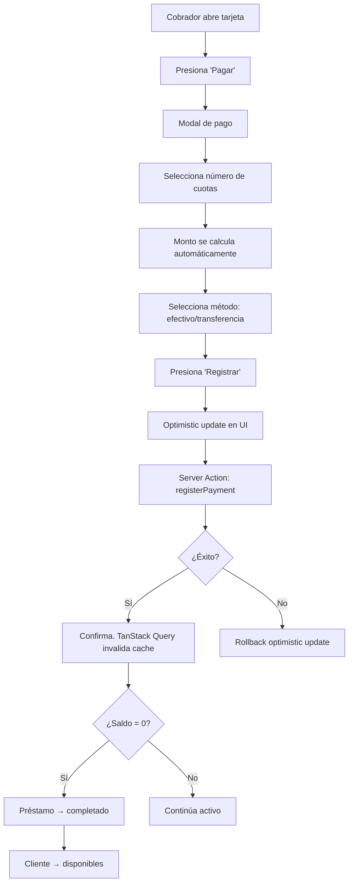
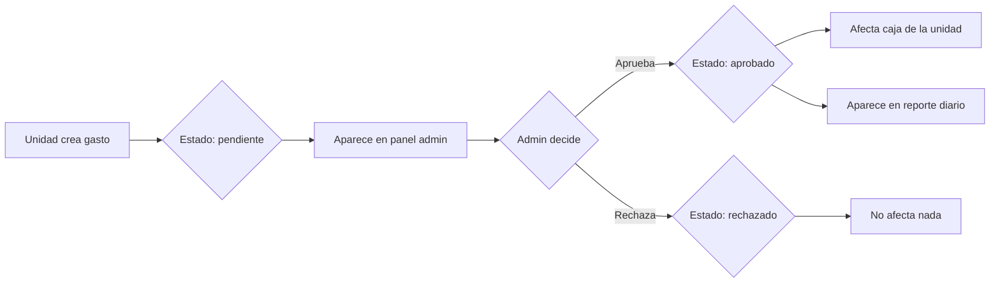
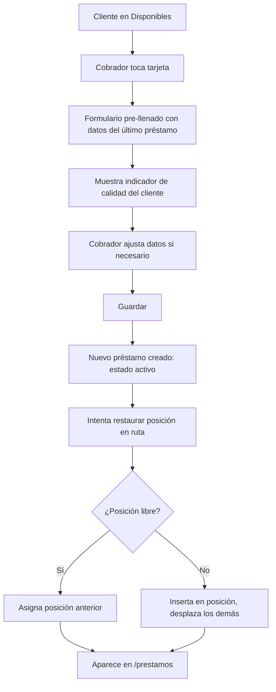
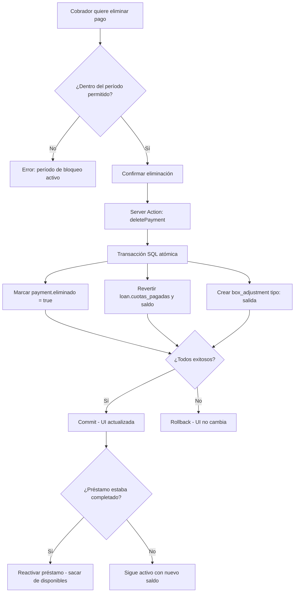
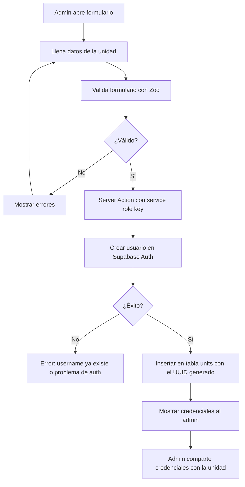

# Flujos del Sistema — DinoPay

[[INDEX|← Volver al Index]]

---

## Flujo 1: Autenticación

```mermaid
flowchart TD
    A[Usuario entra a la app] --> B{¿Tiene sesión activa?}
    B -->|No| C[/login]
    B -->|Sí| D{¿Qué rol tiene?}
    C --> E[Ingresa credenciales]
    E --> F{¿Son válidas?}
    F -->|No| G[Error: credenciales inválidas]
    G --> E
    F -->|Sí| D
    D -->|Admin| H[/admin/dashboard]
    D -->|Unidad| I[/unidad/prestamos]
    D -->|Desconocido| C
```

---

## Flujo 2: Ciclo de Vida del Préstamo

```mermaid
flowchart LR
    A[Cliente nuevo] --> B[/unidad/nuevo]
    B --> C{Préstamo creado}
    C -->|Estado: activo| D[/unidad/prestamos]
    D --> E{¿Saldo = 0?}
    E -->|No| F[Registra pagos periódicos]
    F --> E
    E -->|Sí| G[Préstamo completado]
    G --> H[/unidad/disponibles]
    H --> I{¿Nuevo préstamo?}
    I -->|Sí| D
    I -->|No| J[Cliente espera]
```

---

## Flujo 3: Registro de Pago



---

## Flujo 4: Gasto → Aprobación



---

## Flujo 5: Cliente Disponible → Nuevo Préstamo



---

## Flujo 6: Eliminación de Pago



---

## Flujo 7: Creación de Nueva Unidad (Admin)



---

## Ver También
- [[reglas-de-negocio/REGLAS]] — Reglas que gobiernan estos flujos
- [[funcionalidades/PANTALLA-PRESTAMOS]] — Pantalla central del flujo diario
- [[arquitectura/BASE-DE-DATOS]] — Tablas involucradas en cada flujo
